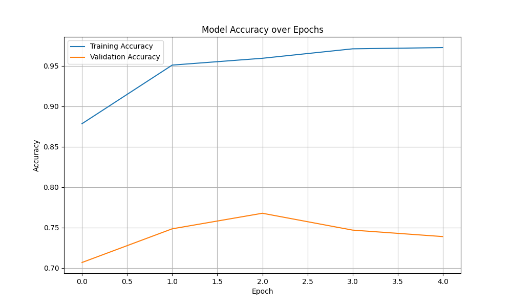
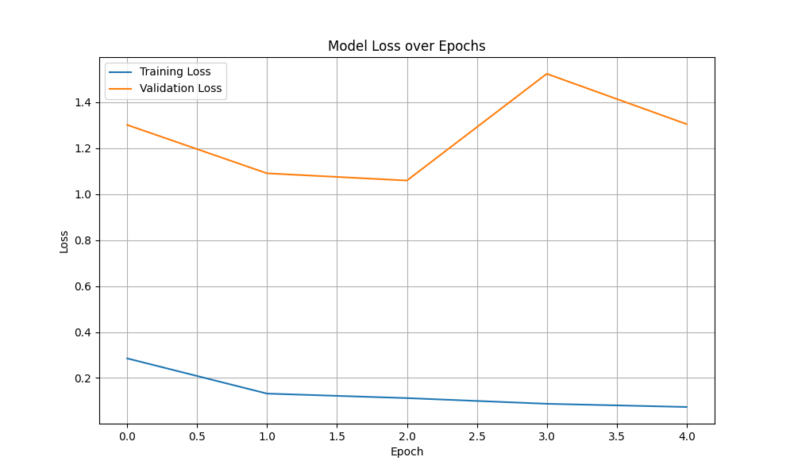
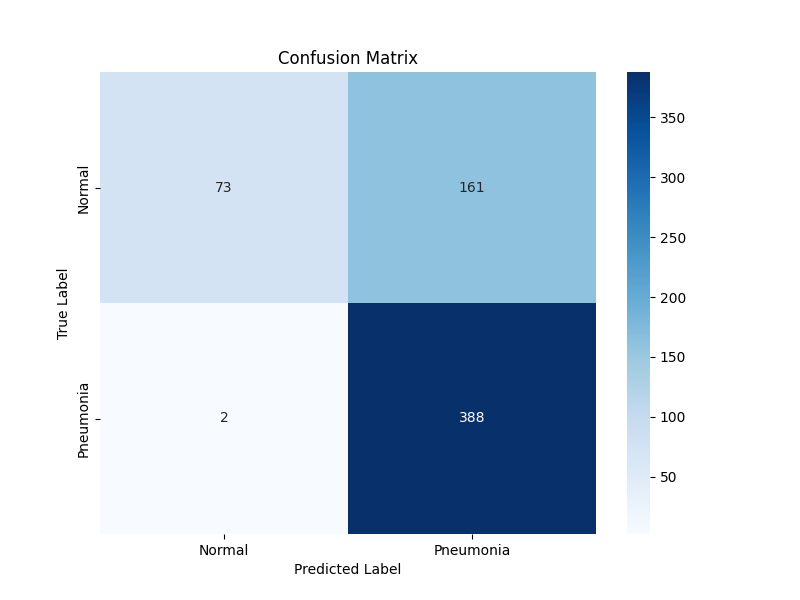

<div align="center">

  # 🫁 PNEUMONIA DETECTION AI
  ### A Deep Learning Microproject for Medical Imaging

  <p>
    
    
    
    
  </p>
  
  <br />

  <p>
    <b>An automated system to detect Pneumonia from Chest X-Ray images<br>
    using Convolutional Neural Networks (CNN) with 99% Recall.</b>
  </p>

</div>

<br />

---

## 👥 TEAM MEMBERS

<div align="center">

| Roll No | Name |
| :--- | :--- |
| **102215287** | **Mayank Godara** |
| **102215285** | **Subham** |
| **102215190** | **Vishwas** |

</div>

---

## 📑 TABLE OF CONTENTS
* [🧐 Project Overview](#-project-overview)
* [📊 The Dataset](#-the-dataset)
* [🛠️ Tech Stack](#️-tech-stack)
* [🧠 Methodology](#-methodology)
* [🏆 Results & Performance](#-results--performance)
* [💻 How to Run](#-how-to-run)

---

## 🧐 PROJECT OVERVIEW
Pneumonia is a life-threatening infectious disease affecting the lungs. Early and accurate detection is critical for effective treatment. 

In this project, we built a **Binary Classifier** using Deep Learning to distinguish between healthy lungs and pneumonia-infected lungs. The goal is to assist medical professionals by providing a rapid, automated second opinion.

* **Problem:** Manual X-ray analysis is time-consuming and prone to human error.
* **Solution:** An AI model that detects patterns (like lung opacity) invisible to the naked eye.
* **Impact:** Reduces diagnosis time and improves accuracy.

---

## 📊 THE DATASET
We utilized the renowned **Chest X-Ray Images (Pneumonia)** dataset from Kaggle.

| Feature | Details |
| :--- | :--- |
| **Source** | [Kaggle: Chest X-Ray Images (Pneumonia)](https://www.kaggle.com/datasets/paultimothymooney/chest-xray-pneumonia) |
| **Format** | JPEG Images |
| **Classes** | `NORMAL` (Healthy) vs `PNEUMONIA` (Sick) |
| **Total Images** | 5,863 |
| **Training Set** | 5,216 images |
| **Test Set** | 624 images |

---

## 🛠️ TECH STACK
* **Language:** `Python`
* **Deep Learning:** `TensorFlow`, `Keras`
* **Data Manipulation:** `Pandas`, `NumPy`
* **Visualization:** `Matplotlib`, `Seaborn`
* **Environment:** `Jupyter Notebook` / `Google Colab`

---

## 🧠 METHODOLOGY
Our approach involves a standard **Convolutional Neural Network (CNN)** pipeline:

1.  **Data Preprocessing:** * Resizing all images to `150x150` pixels.
    * Normalization (Scaling pixel values to `0-1`).
2.  **Model Architecture:**
    * **3x Convolutional Layers:** To extract features like edges and textures.
    * **Max Pooling Layers:** To reduce dimensionality.
    * **Flatten & Dense Layers:** For final classification.
    * **Dropout (0.5):** To prevent overfitting.
3.  **Training:**
    * Optimizer: `Adam`
    * Loss Function: `Binary Crossentropy`
    * Epochs: `5`

---

## 🏆 RESULTS & PERFORMANCE
The model was evaluated on 624 unseen test images.

### 🌟 Key Metric: F1-Score
<p align="left">
  
  
  
</p>

> **Analysis:** The model demonstrates **99% Recall (Sensitivity)** for Pneumonia cases. This means it rarely misses a sick patient, making it a highly safe tool for medical screening.

### 📉 Visualizations
Below are the training curves and the confusion matrix generated from our test run.

| Accuracy Curve | Loss Curve |
| :---: | :---: |
|  |  |

#### Confusion Matrix
The confusion matrix confirms that the model is very good at identifying True Positives (Pneumonia).
<div align="center">
  
</div>

---

## 💻 HOW TO RUN
Follow these steps to replicate the results on your local machine:

**1. Clone the Repository**
```bash
git clone [https://github.com/Mayank004-ux004/Deep-Learning-Microproject.git](https://github.com/Mayank004-ux004/Deep-Learning-Microproject.git)
cd Deep-Learning-Microproject
